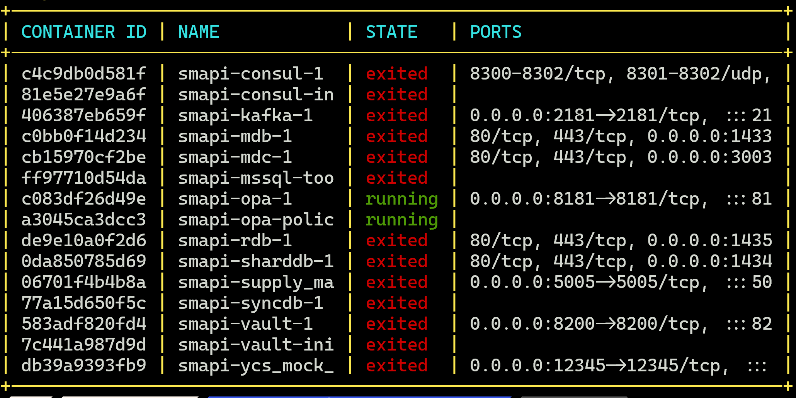

## DKPS

This is a Bash script that provides a formatted and color-coded output of Docker containers running on your system. It uses the `docker ps` command to fetch the details of the containers and then formats the output in a tabular form.

### Features

- Color-coded output for easy readability.



### wsl/Linux Installation

Run below command to install dkps

```bash
git clone https://github.com/fasilmarshooq/dkps.git && cd dkps && chmod +x installer_linux.sh && ./installer_linux.sh
```

### Windows powershell Installation

Run below command to install dkps and reload powershell

```ps1
git clone https://github.com/fasilmarshooq/dkps.git; cd .\dkps\; Add-Content -Path $PROFILE -Value "`nfunction dkps { sh `"$PWD\dkps.sh`" }"
```

Ensure that you have the necessary permissions to execute the script. If not, you can add them using the chmod command:
